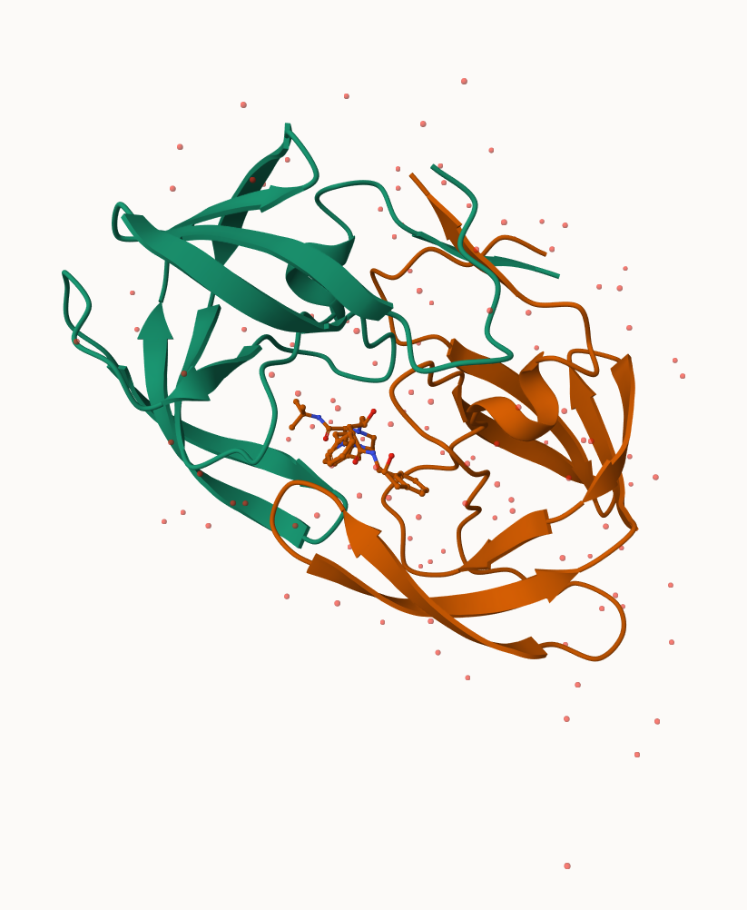
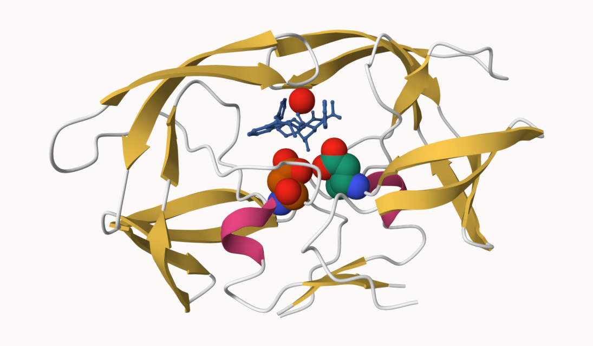

# class 09
Aaron Liu A13908620

\##Download a CSV file from the PDB site (accessible from “Analyze” \>
“PDB Statistics” \> “by Experimental Method and Molecular Type”. Move
this CSV file into your RStudio project and use it to answer the
following questions:

> Q1: What percentage of structures in the PDB are solved by X-Ray and
> Electron Microscopy.

``` r
PDB_summary<- read.csv("Data Export Summary.csv", row.names = 1)
```

a function to drop the comma :(

``` r
rm.comma<-function(x){
  as.numeric(gsub(",","",x))
}
PDB_summary1<-apply(PDB_summary, 2, rm.comma)
rownames(PDB_summary1)<-rownames(PDB_summary)
PDB_summary1
```

                             X.ray    EM   NMR Multiple.methods Neutron Other
    Protein (only)          158844 11759 12296              197      73    32
    Protein/Oligosaccharide   9260  2054    34                8       1     0
    Protein/NA                8307  3667   284                7       0     0
    Nucleic acid (only)       2730   113  1467               13       3     1
    Other                      164     9    32                0       0     0
    Oligosaccharide (only)      11     0     6                1       0     4
                             Total
    Protein (only)          183201
    Protein/Oligosaccharide  11357
    Protein/NA               12265
    Nucleic acid (only)       4327
    Other                      205
    Oligosaccharide (only)      22

``` r
PDB_summary1_total <-apply(PDB_summary1, 2, sum)
round(PDB_summary1_total/PDB_summary1_total["Total"]*100, 2)
```

               X.ray               EM              NMR Multiple.methods 
               84.83             8.33             6.68             0.11 
             Neutron            Other            Total 
                0.04             0.02           100.00 

> Q2: What proportion of structures in the PDB are protein?

Skipped

> Q3: Type HIV in the PDB website search box on the home page and
> determine how many HIV-1 protease structures are in the current PDB?

Skipped

\#Using Mol to examine HIV-Pr

HIV-PR Picture  \#Prettier image with the water and 2
sidechains

 \>Q4: Water molecules normally have 3
atoms. Why do we see just one atom per water molecule in this structure?

Because the cystrallography only have resolution of 2A, which is bigger
than the H atom so therefore H is not showing in here.

> Q5: There is a critical “conserved” water molecule in the binding
> site. Can you identify this water molecule? What residue number does
> this water molecule have

See above images, Water 308

> Q6: Generate and save a figure clearly showing the two distinct chains
> of HIV-protease along with the ligand. You might also consider showing
> the catalytic residues ASP 25 in each chain and the critical water (we
> recommend “Ball & Stick” for these side-chains). Add this figure to
> your Quarto document.

See above images.

\##BIO3D!!!!!

``` r
library(bio3d)
pdb<-read.pdb("1hsg")
```

      Note: Accessing on-line PDB file

``` r
pdb
```


     Call:  read.pdb(file = "1hsg")

       Total Models#: 1
         Total Atoms#: 1686,  XYZs#: 5058  Chains#: 2  (values: A B)

         Protein Atoms#: 1514  (residues/Calpha atoms#: 198)
         Nucleic acid Atoms#: 0  (residues/phosphate atoms#: 0)

         Non-protein/nucleic Atoms#: 172  (residues: 128)
         Non-protein/nucleic resid values: [ HOH (127), MK1 (1) ]

       Protein sequence:
          PQITLWQRPLVTIKIGGQLKEALLDTGADDTVLEEMSLPGRWKPKMIGGIGGFIKVRQYD
          QILIEICGHKAIGTVLVGPTPVNIIGRNLLTQIGCTLNFPQITLWQRPLVTIKIGGQLKE
          ALLDTGADDTVLEEMSLPGRWKPKMIGGIGGFIKVRQYDQILIEICGHKAIGTVLVGPTP
          VNIIGRNLLTQIGCTLNF

    + attr: atom, xyz, seqres, helix, sheet,
            calpha, remark, call

``` r
attributes(pdb)
```

    $names
    [1] "atom"   "xyz"    "seqres" "helix"  "sheet"  "calpha" "remark" "call"  

    $class
    [1] "pdb" "sse"

``` r
head(pdb$atom)
```

      type eleno elety  alt resid chain resno insert      x      y     z o     b
    1 ATOM     1     N <NA>   PRO     A     1   <NA> 29.361 39.686 5.862 1 38.10
    2 ATOM     2    CA <NA>   PRO     A     1   <NA> 30.307 38.663 5.319 1 40.62
    3 ATOM     3     C <NA>   PRO     A     1   <NA> 29.760 38.071 4.022 1 42.64
    4 ATOM     4     O <NA>   PRO     A     1   <NA> 28.600 38.302 3.676 1 43.40
    5 ATOM     5    CB <NA>   PRO     A     1   <NA> 30.508 37.541 6.342 1 37.87
    6 ATOM     6    CG <NA>   PRO     A     1   <NA> 29.296 37.591 7.162 1 38.40
      segid elesy charge
    1  <NA>     N   <NA>
    2  <NA>     C   <NA>
    3  <NA>     C   <NA>
    4  <NA>     O   <NA>
    5  <NA>     C   <NA>
    6  <NA>     C   <NA>

``` r
head(pdb$atom$resid)
```

    [1] "PRO" "PRO" "PRO" "PRO" "PRO" "PRO"

``` r
aa321(pdb$atom$resid[pdb$calpha])
```

      [1] "P" "Q" "I" "T" "L" "W" "Q" "R" "P" "L" "V" "T" "I" "K" "I" "G" "G" "Q"
     [19] "L" "K" "E" "A" "L" "L" "D" "T" "G" "A" "D" "D" "T" "V" "L" "E" "E" "M"
     [37] "S" "L" "P" "G" "R" "W" "K" "P" "K" "M" "I" "G" "G" "I" "G" "G" "F" "I"
     [55] "K" "V" "R" "Q" "Y" "D" "Q" "I" "L" "I" "E" "I" "C" "G" "H" "K" "A" "I"
     [73] "G" "T" "V" "L" "V" "G" "P" "T" "P" "V" "N" "I" "I" "G" "R" "N" "L" "L"
     [91] "T" "Q" "I" "G" "C" "T" "L" "N" "F" "P" "Q" "I" "T" "L" "W" "Q" "R" "P"
    [109] "L" "V" "T" "I" "K" "I" "G" "G" "Q" "L" "K" "E" "A" "L" "L" "D" "T" "G"
    [127] "A" "D" "D" "T" "V" "L" "E" "E" "M" "S" "L" "P" "G" "R" "W" "K" "P" "K"
    [145] "M" "I" "G" "G" "I" "G" "G" "F" "I" "K" "V" "R" "Q" "Y" "D" "Q" "I" "L"
    [163] "I" "E" "I" "C" "G" "H" "K" "A" "I" "G" "T" "V" "L" "V" "G" "P" "T" "P"
    [181] "V" "N" "I" "I" "G" "R" "N" "L" "L" "T" "Q" "I" "G" "C" "T" "L" "N" "F"

``` r
length(aa321(pdb$atom$resid[pdb$calpha]))
```

    [1] 198

\#Run a normal mode analysis(NMA)- a bioinfomatic prediction

``` r
adk<-read.pdb("6s36")
```

      Note: Accessing on-line PDB file
       PDB has ALT records, taking A only, rm.alt=TRUE

``` r
modes<-nma(adk)
```

     Building Hessian...        Done in 0.029 seconds.
     Diagonalizing Hessian...   Done in 0.852 seconds.

``` r
plot(modes)
```


``` r
mktrj(modes, file="modes.pdb")
```

> Q7: How many amino acid residues are there in this pdb object?

198

> Q8: Name one of the two non-protein residues?

HOH (127)

> Q9: How many protein chains are in this structure?

2
